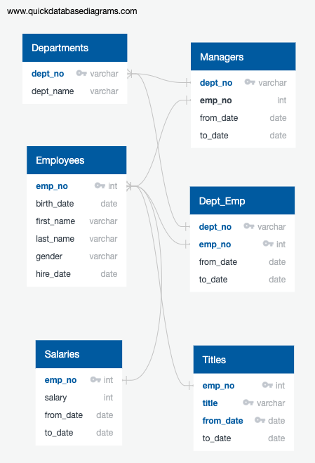

# Pewlett-Hackard-Analysis

  881 number of employees are retiring. 
  1549 number of individuals are available for the mentorship role.
  
  As part of the reccomendation, it can be seen that there are more than enough number of retiring employees that are    available for the mentorship program so any new hires should not have trouble having access to a mentor. The company should allow many mentors to be available to the new hires. 
  
## ERD od the database

  

  
